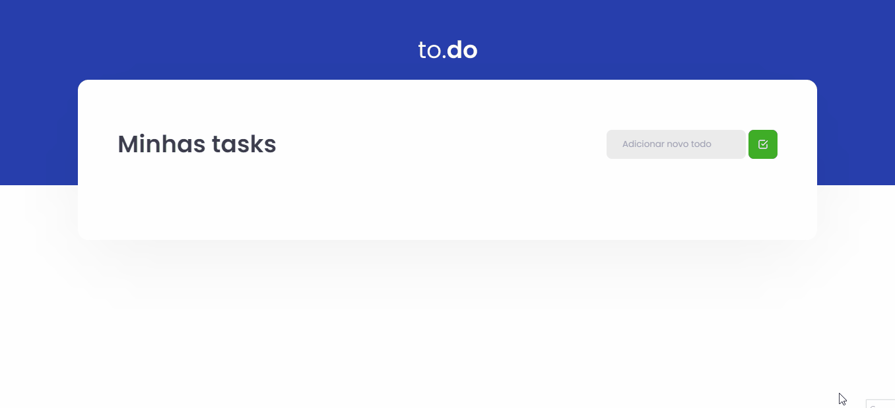

<section align="center">
    
</section>

---

<h2 align="center">Summary</h2>

    <a href="#description">📙 Description</a>
    <a href="#preview">🖼️ Preview</a>
    <a href="#technologies">💻 Technologies</a>

<H2 id="about">📙 Description</H2>

Small challenge to introduce and review basic concepts of ReactJs learned on the first chapter of the course. Most of functionalities are already implemented and the task was to edit TaskList.tsx and implement the basic "todolist" features such as:
<ul>
<li>Add new task</li>
<li>Toggle the completed tasks</li>
<li>Remove task</li>
</ul>

Originally created on Ignite from <a href="https://www.rocketseat.com.br/">Rocketseat</a> and made by <a href="https://www.linkedin.com/in/kleverson-kenji-iwatani/">Kenji Iwatani</a>

    <h3><a href="https://www.notion.so/Desafio-01-Conceitos-do-React-51e4099a6e2f4d4bae94f9fe75bb769d">Challenge description &rarr;</a></h3>

---

<H2 id="preview">🖼️ Preview</H2>

<section align="center">
    
</section>

---

<H2 id="technologies">💻 Technologies</H2>

- [x] <a href="https://reactjs.org/">React</a>
- [x] <a href="https://www.typescriptlang.org/">Typescript</a>
